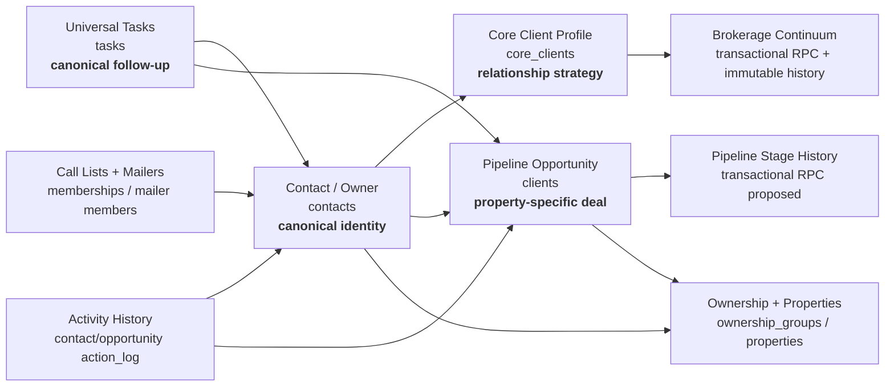

# Stabilization Sprint Report

Date: July 30, 2026  
Branch: `codex/stabilization-executive-quality`  
Production baseline: `33bf531`  
Deployment status: **not deployed**

## Executive summary

This sprint establishes clear person, relationship, and opportunity boundaries
without a disruptive schema rewrite. It makes the universal task engine the only
new follow-up write path in the Core Client and Pipeline creation workflows,
hardens multi-record review actions, adds read-only system diagnostics, and
reduces the initial JavaScript payload by approximately 44%.

## System architecture



## Stabilized decisions

### Person versus opportunity

- A linked contact now wins for owner name, phone, email, lead source, age,
  mailing addresses, notes, and lead temperature in Pipeline-facing views.
- Editing a linked opportunity no longer writes copied person fields back into
  the contact row.
- Legacy copied columns remain populated for compatibility; no destructive
  migration is included.

### Follow-up truth

- New Core Client and Pipeline follow-ups create rows in `tasks`.
- Those workflows no longer create new values in legacy next-action columns.
- Existing legacy values remain readable as fallback until a future cleanup
  migration is proven safe.
- Task title and due date are validated as an all-or-nothing pair.
- If opportunity creation succeeds but task creation fails, the app attempts to
  remove the incomplete opportunity and reports whether compensation succeeded.

### Activity reliability

- Email-review confirm, dismiss, and reassign now await database results.
- Reassignment adds the destination copy first, removes the source second, and
  compensates by removing the destination copy if the source update fails.
- UI errors remain visible instead of silently closing the decision.
- Activity-log mutation helpers now return explicit success/error results.

### Migration and runtime health

- The header now exposes a read-only **Health** modal.
- It probes required and optional tables, reports runtime migration signals, and
  points to the exact SQL file for missing capabilities.
- Server-only Salesforce import access is classified correctly rather than
  reported as a broken public table.
- The optional persisted market-news and Salesforce row-table gaps are visible
  without blocking core CRM use.

### Performance

- Dashboard, Database, Pipeline, and Core Clients are lazy-loaded.
- Initial bundle before: approximately 960 KB minified / 256 KB gzip.
- Initial bundle after: approximately 539 KB minified / 150 KB gzip.
- Database is now a separate approximately 234 KB chunk.
- Dashboard is now a separate approximately 61 KB chunk.

## Proposed database migration

No SQL was run during this sprint.

### Apply order

1. Confirm `sql/core_clients_pipeline_migration.sql` is already applied.
2. Run `sql/pipeline_stage_rpc_migration.sql` in the Supabase SQL Editor.
3. Refresh the CRM.
4. Move one non-critical Pipeline opportunity by one stage.
5. Open **Health** and confirm **Atomic Pipeline stage RPC** changes to Ready.
6. Verify the opportunity stage, embedded activity event, and
   `pipeline_stage_history` record all share the same transition.

The app uses the existing two-request compatibility path until this migration is
applied. Afterward, one RPC updates the opportunity and appends history in the
same database transaction.

### Rollback

```sql
drop function if exists public.change_pipeline_stage(uuid, integer, text, text);
```

This removes only the RPC. It does not remove or rewrite opportunities, activity,
or stage history, and the app automatically resumes its compatibility path.

## Verification

- `npm run lint` — pass
- `npm test` — pass, including stabilization mapping and schema classification
- `npm run build` — pass
- Local visual smoke test — pass:
  - Dashboard lazy load
  - Health modal and live read-only probes
  - Core Clients table
  - Core Client detail remains in the Core Clients view
  - call notes, activity, open/completed tasks, and Brokerage Continuum render
  - Core Client follow-up fields use universal-task language
  - Pipeline opportunity follow-up fields use universal-task language
  - no captured browser console warnings or errors during these paths

The Vite-only local Dashboard still cannot execute serverless `/api` functions;
the existing market-intelligence fallback message is expected in that mode and
was not treated as a regression.

## Remaining risks

1. The Pipeline stage compatibility path remains non-atomic until the proposed
   RPC migration is run.
2. Activity JSON arrays can still suffer last-write-wins conflicts if the same
   record is edited concurrently in multiple sessions.
3. The physical `clients` identity columns remain duplicated for compatibility.
4. Legacy next-action columns remain readable and some older Database/Call Mode
   paths still maintain them.
5. Optional persisted market news is not installed in production.
6. The main application chunk is still slightly over Vite's 500 KB warning
   threshold; hooks and shared dependencies are the next splitting target.

## Recommended next sprint

1. Apply and verify the Pipeline stage RPC.
2. Design an append-only `activities` table and backfill strategy.
3. Finish migrating legacy Database/Call Mode next-action writes to `tasks`.
4. Add a lightweight entity invalidation bus for multi-tab/live-session refresh.
5. Decide whether to install persisted Market Intelligence tables.
6. Finish the dark-launched Salesforce import schema or remove its inactive row
   probe and flag.

